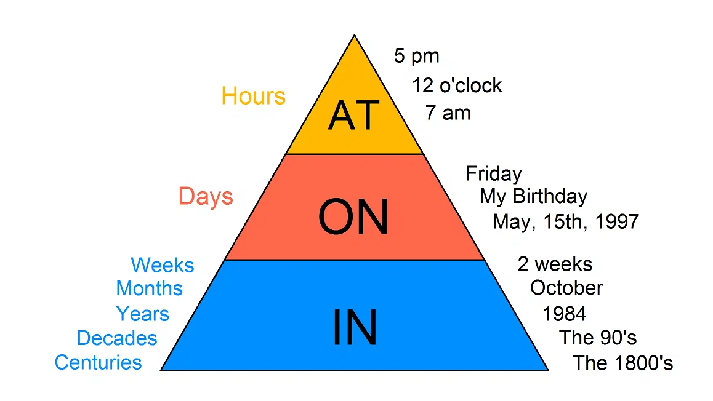

# Теория
+ [Фонетика](#Фонетика)
+ [Артикли](#Артикли)
+ [Предлоги](#Предлоги)

## Фонетика

__Гласные__

+ __Открытые слоги__ - заканчиваются на гласную, а __Закрытые слоги__ - на согласную

В откр. сл. гласная чаще всего читается так же, как в звучит алфавите. Кроме Y - она читается как "ай"

__La-te, be, li-ke, go, tu-ne, my__

К откр. относятся и слова с немой "е" в конце

__Ta-ke, no-se, cu-te, Pe-te__

В закр. сл. гласная дает краткий звук

| Буква | Открытый слог         | Закрытый слог                                       | Гл. + r             | Гл. + r + e<br/> или<br/> Гл. + гл. + r |
|-------|-----------------------|-----------------------------------------------------|---------------------|-----------------------------------------|
| А a   | [ ei ]                | [ æ ]                                               | [a:r]               | [e:r]                                   |
|       | как в алфавите        | как Э но челюсть сильно ниже                        |                     |                                         |
|       | bake, cake, tale      | plan, fat, cap                                      | star, car, far, bar | parents, chair, square                  |
|       |                       |                                                     |                     |                                         |
| O o   | [ou]                  | [o:]                                                | [o:r]               | [o:r]                                   |
|       | как в алфавите        | как А но губы округляются, "уточкой"                |                     |                                         |
|       | bone, nose, rope      | fog, dot, stop, top, hot                            | port, resort        | more, shore, bore                       |
|       |                       |                                                     |                     |                                         |
| U u   | [u:]                  | [ Λ ]                                               | [ə:r]               | [jur]                                   |
|       | как в алфавите        | ленивая А, рот еле открыт                           | Открытый слог       | "слайд" с мягкого знака                 |
|       | YouTube, mule         | nut, sun, butter                                    | turn, burn          | pure, cure                              |
|       | [русская У]           |                                                     |                     |                                         |
|       | чаще всего после r, j |                                                     |                     |                                         |
|       | june, rule            |                                                     |                     |                                         |
|       |                       |                                                     |                     |                                         |
| E e   | [i:]                  | [e]                                                 | [ə:r]               | [i:r]                                   |
|       | как в алфавите        |                                                     |                     |                                         |
|       | delete, me, Pete, she | pen, bed, red, get                                  | her, prefer         | here, fear, beer, dear, near            |
|       |                       |                                                     |                     |                                         |
| I i   | [ai]                  | [i]                                                 | [ə:r]               | [air]                                   |
|       |                       | как И но лениво<br/>  без напряж. губ, горла, языка |                     |                                         |
|       | life, bike, drive     | big, lip, thin, tip, kill                           | girl, first         | fire, liar                              |
|       |                       |                                                     |                     |                                         |
| Y y   | [ai]                  | [i]                                                 | [ə:r]               | [air]                                   |
|       |                       |                                                     |                     | мало слов с таким звуком                |
|       | my, style             | symbol, system                                      | myrtle              | tyre                                    |

Y в начале слова перед гласной превращается в "Й"

__Year, yellow, yet, yes__

В безударном слоге в "И"

__Sixty, foggy, twenty__ 

__Согласные__

## Артикли


Ставятся перед сущ и служат аналогами прилагательных - описывают сущ, дают нам понять что слово явл сущ

+ Определенный THE 
+ Неопределенный A / AN
+ Нулевой предлог

1) __Определенный предлог THE__

+ Перед сущ, которые уже известны из контекста, ситуации или общих знаний. Повторное упоминание
```
I saw (a) dog on the street. (The) dog was very fluffy
```

+ Уникальные, единственные в своем роде сущ
```
The sun is shining
```

+ Перед порядковыми сущ т.к. они по сути уникальны
``` 
The first man in Space
The 4th of July
The second date - не бывает еще одного "второго свидания"
```

+ С прилагательными в превосходной степени, самый-самый, уникальный
```
I'm the luckiest person ever
She is the happiest woman
```

2) __Неопределенный A / AN__

An ставится перед словом на гласный _звук_, не букву

+ Что-то в ед. ч
+ Что-то общее, а не конкретное - один из..., какой-то..., некоторый. Когда сущ. выступает в роле представителя группы чего-либо, обобщающим понятием лля всей группы. В этом случае вместо артикля можно подставить "любой", "каждый", "всякий" - every, any
```
I need a new computer - любой пк подойдет, не конкретный, главное чтобы новый 
A computer is a very useful thing
```
+ Когда "А" в значении "one" - один
```
I'd like a cup of tea
I'll be there in an hour
```
+ Когда говорим о чём-то впервые
```
This is a beatiful building. Do you remember the building that we saw yesterday?
```
3) __Нулевой артикль__

+ Сущ во мн.ч, когда говорим о какой-то обобщенной группе
```
People will always envy each other - люди в общем
The people will always envy each other - конкретные люди
Trees are so important for the Earth
```

+ С неисчесляемыми сущ: вещества, газы, абстрактные понятия (доброта)
```
Kidness is the key to communication
I need water
He never eats cheese
```

__Исключения__: в современном англ. можно употребить некоторые неисчес. сущ с артиклем, если речь идет о конкретном обьеме и подразумеваается конкретное количество
```
Can I get a water = Can I get (a glass of) water
```
+ Перед названиями:
- Видов спорта, игр
```
She does horse riding
```
- Напитков, блюд
```
I love cooking pasta for lunch

но если речь про конкретную пасту, которую вчера приготовили и убрали в холодильник, то the pasta
```
- Языков
```
Do you speak English?
```
- Цвета
- Города
- Страны
```
Germany is a part of the European Union
```
__Исключения__: Но если в названии страны есть Kingdom, Federation, Republic и прочие виды обьединений, то + the

__Исключения__: Если название страны во мн.ч, + the
```
The Philippines
```

- Некоторые географические обьекты
```
Lake Baikal, 
Australia is both a country and a continent
```
[к оглавлению](#Теория)


## Предлоги

Чем меньше сектор предлога, тем меньше зона его влияния

1) __Времени__



- __At__ - отвечает за часовые отрезки.
```
At 7 o'clock
At lunch
At the end of the movie
At the moment
```
__Исключения:__ at night

- __On__ - промежуток 1-3 дня, конкретные даты, дни недели
```
On Monday
On August 12th
On my birtday
On the weekend
```
__Исключения:__ on my lunch break, on time

- __In__ - недели, месяцы, годы, декады
```
In April
In 2022
In 18th century
In the future
```
__Исключения:__ in the morning, in the evening, in the afternoon

2) __Места__


- __At__ - малое место, точка, адрес, специфическая локация
```
At 221b Baker Street
At the shop
```

- __On__ - протяженные местности, улицы, реки, пляж
```
On Baker Street
On the beach
On my street
```

- __In__ - страны, города, районы
```
In Russia
In Moscow
```

3) __Расположение в пространстве__

- __At__ - точка на местности
```
At the bus stop
At the top of the hill
At the corner
```

- __On__ - поверхность
```
On the table
On the wall
Tattoos on my body
```

- __In__ - для закрытых, ограниченных пространств
```
In the kitchen
In the room
In the fish tank
```

А так же для транспорта
```
In a car
In a taxi
```

__Исключения:__ ride on a bike, motobike, horse - логично, потому что сидишь сверху, как на поверхности

[к оглавлению](#Теория)